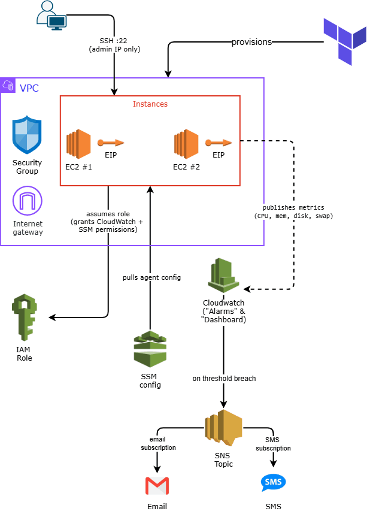

A modular Terraform project provisioning a small monitored EC2 cluster on AWS: custom CloudWatch metrics (memory, disk, swap) via the CloudWatch Agent, CPU/memory/disk alarms, and SNS-based alerting. See "Design Decisions & Trade-offs" below for the reasoning behind each choice, not just the what.

## Architecture

