## Replication Steps

1. **Clone the repo**
   ```
   git clone <repo-url>
   cd cw-observability/terraform
   ```

2. **Create an EC2 key pair** in your target region (AWS Console → EC2 → Key Pairs → Create key pair, or `aws ec2 create-key-pair`). Download and store the `.pem` file locally (e.g. `~/.ssh/`), `chmod 400`. Note the exact key pair *name* - this is what goes in Terraform, not the file path.
   `[Screenshot: key pair created in console, showing the name]`

3. **Configure AWS CLI credentials** for a dedicated deployer identity (not root):
   ```
   aws configure --profile cw-observability
   ```
   Enter access key, secret key, region, output format.
   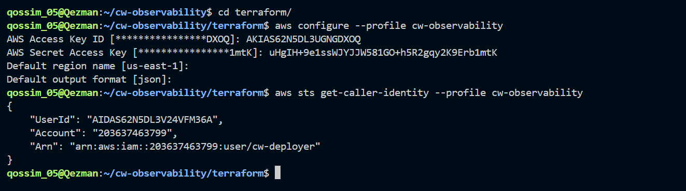

4. **Populate `terraform.tfvars`** (committed, non-sensitive): `aws_region`, `project_name`, `vpc_cidr`, `public_subnet_cidr`, `availability_zone`, `ssh_allowed_cidr` (leave as placeholder), `key_name` (from step 2).
   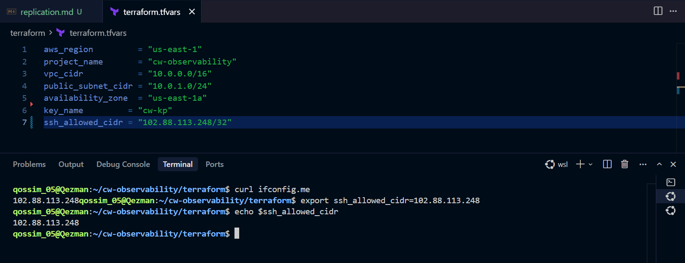

5. **Populate `secrets.tfvars`** (gitignored, sensitive): `ssh_allowed_cidr` = your real IP (`curl ifconfig.me`), `alarm_email`, `alarm_sms`.
   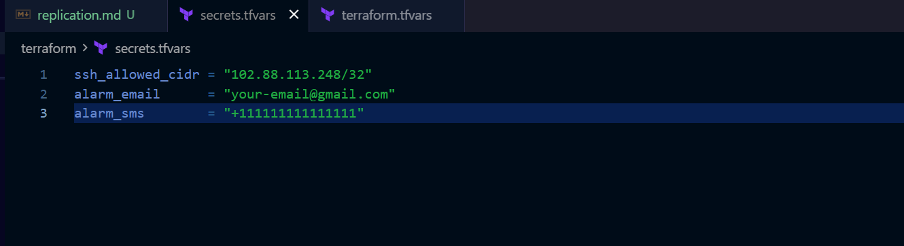

6. **Initialize Terraform:**
   ```
   terraform init
   ```
   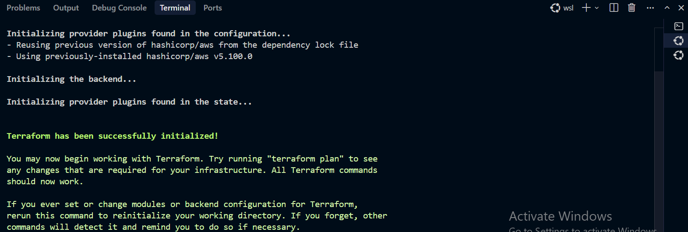

7. **Run the plan:**
   ```
   terraform plan -var-file="terraform.tfvars" -var-file="secrets.tfvars"
   ```
   Confirm resource count matches expectations, `0 to destroy`.
   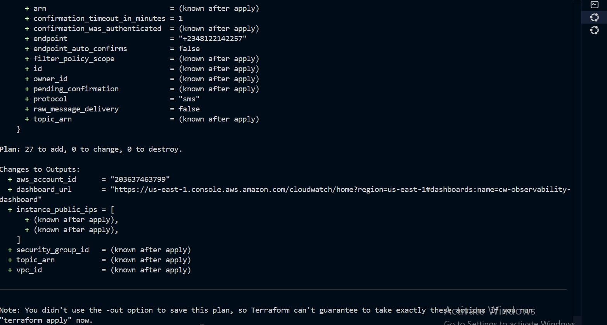

8. **Apply:**
   ```
   terraform apply -var-file="terraform.tfvars" -var-file="secrets.tfvars"
   ```
   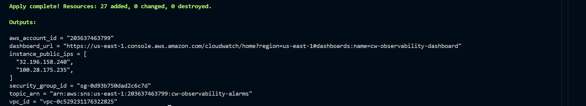

9. *(gap in your numbering - decide whether this stays a gap or gets a step)*

10. **Verify SSH access** to each instance:
    ```
    ssh -i ~/.ssh/<your-key>.pem ec2-user@<instance-public-ip>
    ```
    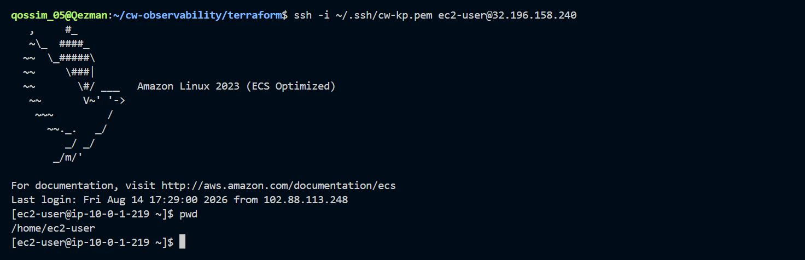

11. **Verify custom metrics are publishing:**
    ```
    aws cloudwatch list-metrics --namespace <project_name> --profile cw-observability
    ```
    Confirm `mem_used_percent`, `disk_used_percent`, `swap_used_percent` all present.
    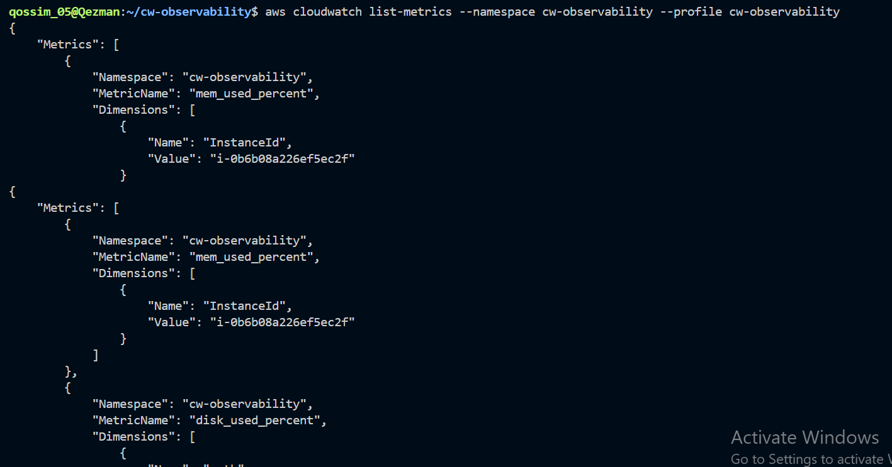

12. **Confirm the SNS email subscription** - check inbox/spam for the confirmation email and click it.
    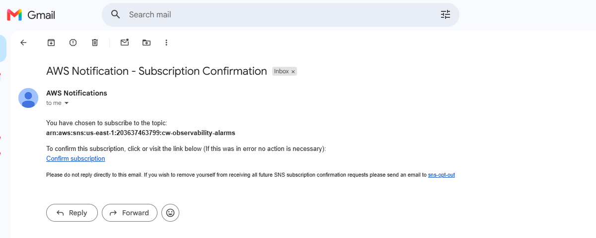

13. **View the CloudWatch dashboard:**
    ```
    terraform output dashboard_url
    ```
    Open the link, confirm all three widgets render with live data.
    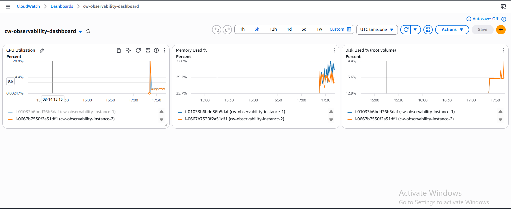

14. **Trigger a test alarm** to confirm the full alerting pipeline:
    ```
    aws cloudwatch set-alarm-state --alarm-name <project_name>-cpu-high-1 \
      --state-value ALARM --state-reason "manual test" --profile cw-observability
    ```
    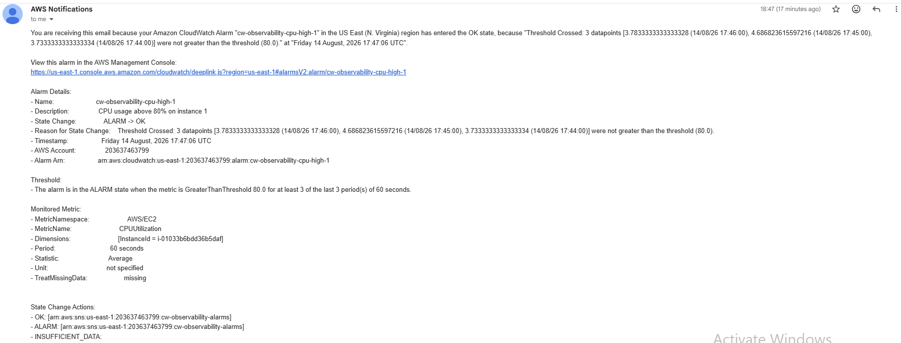

15. **Real-load test:**
    ```
    ssh -i ~/.ssh/<your-key>.pem ec2-user@<instance-public-ip>
    sudo dnf install -y stress-ng
    stress-ng --cpu 2 --timeout 300s
    ```
    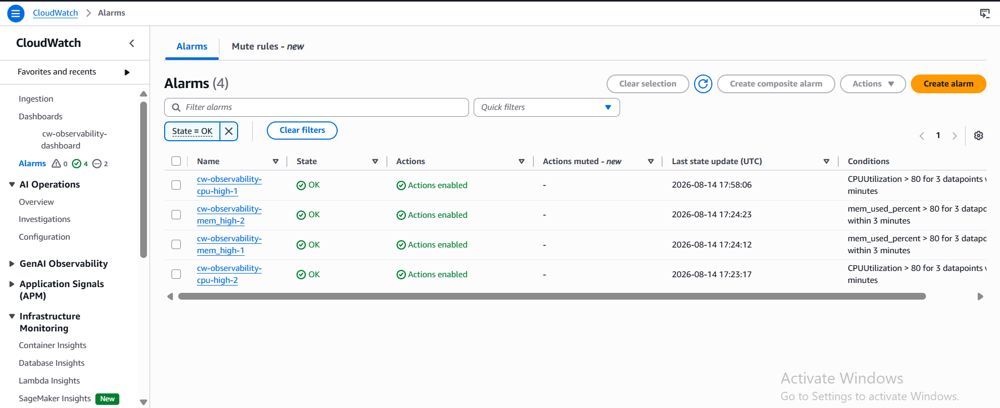

16. **Tear down when finished:**
    ```
    terraform destroy -var-file="terraform.tfvars" -var-file="secrets.tfvars"
    ```
    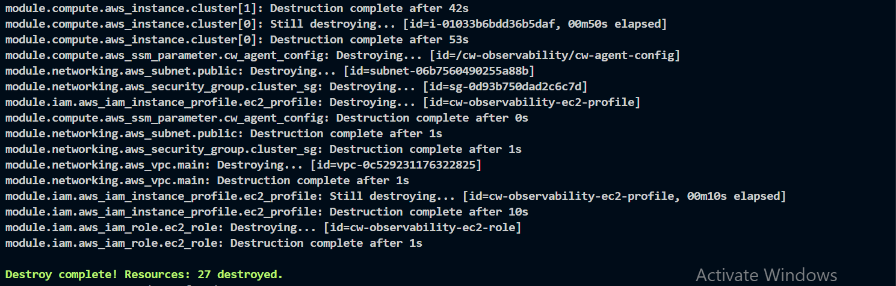
